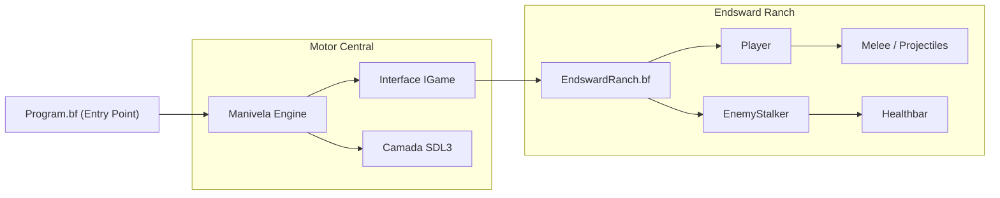

# ⚙️🔥 Manivela Engine

> **Um motor 2D de alta performance e framework de jogo.**

**Manivela Engine** é um motor de jogo personalizado desenvolvido na linguagem **Beef**, com foco em performance e controlo de memória. O projeto tira partido das bibliotecas **SDL3** e **SDL3_image** para a renderização gráfica, gestão de janelas e captura de eventos.

Atualmente, o repositório inclui a implementação central do motor e um jogo de demonstração totalmente jogável chamado *Endsward Ranch*.

## 🛠️ Funcionalidades Principais

| Feature | Ficheiro / Implementação | Descrição |
| --- | --- | --- |
| **Core Loop & Rendering** | `Engine.bf` | Ciclo principal do jogo com cálculo preciso de *delta time* e renderização a 60+ FPS utilizando as funções nativas do SDL3. |
| **Física e Colisões** | `EndswardRanch.bf` | Sistema de deteção de colisão AABB (caixas delimitadoras) e aplicação de *knockback* dinâmico baseado na proporção de massa entre as entidades. |
| **Sistema de Combate** | `Melee.bf` & `Projectile.bf` | Combate com múltiplos estados (Ready, Attacking, Cooldown), ângulos de ataque dinâmicos e projéteis geridos por listas ativas. |
| **Movimento Avançado** | `Player.bf` | Mecânica de *dash* com invencibilidade temporária (i-frames) e *feedback* visual (piscar do *sprite* com modulação de cor). |
| **IA de Perseguição** | `EnemyStalker.bf` | Inimigo base ("Stalker") que calcula e normaliza constantemente vetores de direção para seguir a posição atual do jogador. |

## 📐 Arquitetura do Sistema

A arquitetura assenta na modularidade, separando as lógicas pesadas do motor e a lógica específica do jogo através da interface `IGame`.



## 🚀 Como Executar

### Requisitos

* **Beef IDE** / Compilador Beef
* Bibliotecas **SDL3** e **SDL3_image** instaladas no sistema.

### Configuração do Workspace

O projeto está configurado através de ficheiros TOML do Beef. Certifique-se de que as dependências do SDL3 estão acessíveis nos caminhos definidos no seu `BeefSpace.toml`:

1. Clone o repositório.
2. Abra o ficheiro `BeefSpace.toml` no Beef IDE. O sistema espera encontrar os projetos `SDL3-Beef` e `SDL3_image-Beef` na pasta `/home/eduradolm/Documents/` (terá de ajustar este caminho para o seu ambiente local).
3. Em sistemas Linux (Linux64), as bibliotecas partilhadas (`.so`) devem estar presentes na pasta `/lib64/`.
4. Compile e execute o projeto definido como "StartupObject": `Manivela_Engine.Program`.

## 📂 Estrutura do Projeto

```text
Manivela-Engine/
├── assets/
│   ├── Enemy.png                 # Sprite do Stalker (150x203) 
│   └── Player.png                # Sprite do Jogador (147x201) 
├── src/
│   ├── Engine/
│   │   ├── Engine.bf             # Inicialização do SDL e Game Loop 
│   │   └── IGame.bf              # Interface de polimorfismo para jogos 
│   ├── Game/
│   │   ├── EndswardRanch.bf      # Controlador central do nível/demo 
│   │   ├── Player.bf             # Lógica de inputs, dash e armas 
│   │   ├── EnemyStalker.bf       # Comportamento e físicas do inimigo 
│   │   ├── Melee.bf              # Hitbox giratória de ataque físico 
│   │   ├── Projectile.bf         # Lógica vetorial de projéteis 
│   │   └── Healthbar.bf          # Renderizador visual de vida 
│   └── Program.bf                # Entry point ("Girando a Manivela...") 
├── BeefProj.toml                 # Configurações de compilação do projeto 
└── BeefSpace.toml                # Definição do Workspace e dependências 

```

*(Baseado nos ficheiros reais fornecidos).*

## 💠 Destaques Técnicos

### Física Vetorial e Resolução de Massa

O cálculo de interações físicas (como impactos) afasta-se da colisão rígida básica, utilizando um rácio de massa e interpolação linear para gerir a fricção.

* Quando o jogador e o inimigo colidem, o motor calcula um vetor de direção normalizado (`dx` / `length`, `dy` / `length`).
* A força de repulsão de `2000f` é dividida entre as entidades, calculando o rácio da massa do inimigo contra a massa total (`pRatio`), proporcionando impactos realistas.
* Ambas as entidades abrandam naturalmente a cada *frame* utilizando `Math.Lerp` para aplicar a fricção definida (`friction = 5.0f`).

### Limpeza de Memória e Gestão de Estados

A linguagem Beef permite um rigoroso controlo da memória. As entidades do jogo utilizam destrutores manuais (`~ delete _`) nas classes que englobam objetos como projéteis, barras de vida e *melee*. Quando o *sprite* principal recebe dano, além da perda de `health`, os i-frames impedem danos múltiplos seguidos, com modulação RGB a `128, 128, 128` no *sprite* alternando ciclicamente para sinalizar visualmente a proteção.

---

<p align="center">
Desenvolvido com ✨ por <b>Eduardo Lôbo Moreira</b>.
</p>
